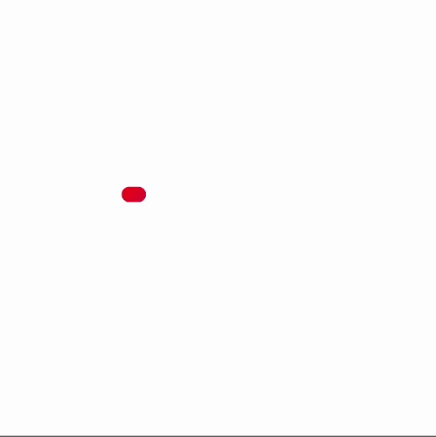
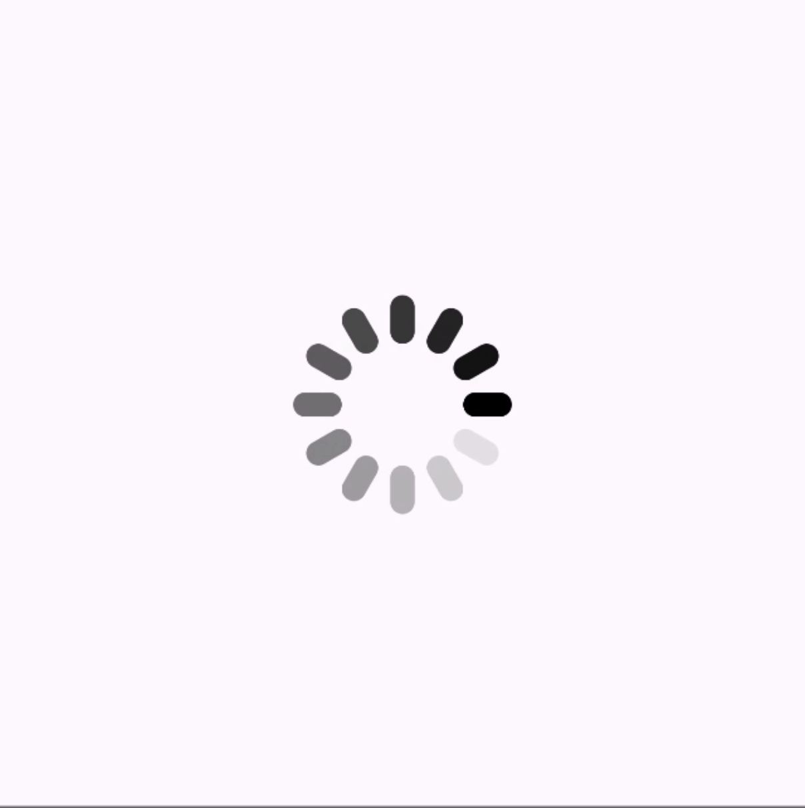
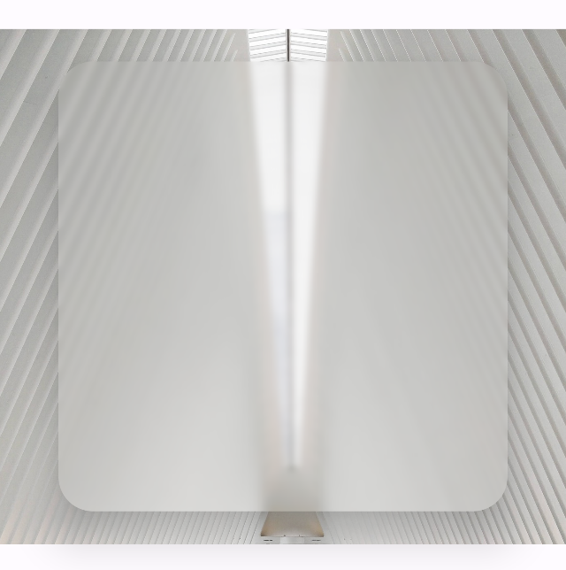

# Example project for Android Bangkok 2023 GDG event.

This is an example project for Hidden Powers of Compose Canvas presentation. 

### 1. Path Animation

### 2. Transformations

### 3. Blend Modes

### 4. Draw With Content

### 5. Text With Shadow

### 6. Blur Effect

### 7. Shader Bursh

### 8. Shader
